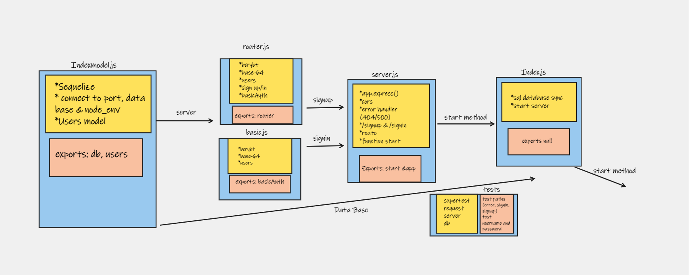

# basic-auth
we begin the first of a 3-Phase build of an authentication system, written in Express.

## UML diagram

## **here are the links for the server:**

**1. The Actions link:**
   [Actions](https://github.com/marah-jaradat/basic-auth/actions)

**2. The Pull request:**
   [pull request](https://github.com/marah-jaradat/basic-auth/pull/10)

**3. Heroku link**
    [deploy-main](https://basic-auth-6.herokuapp.com/)